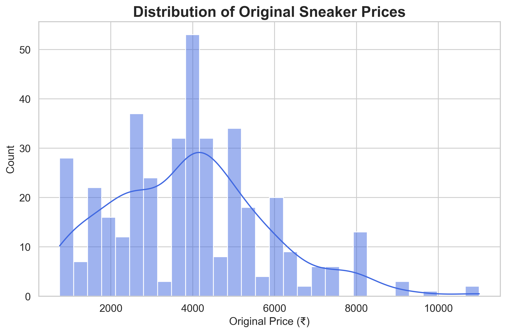
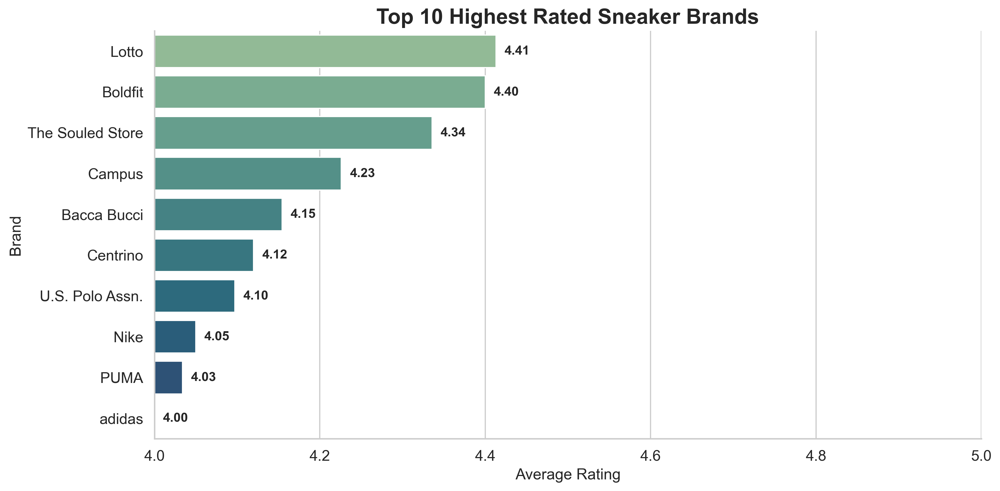
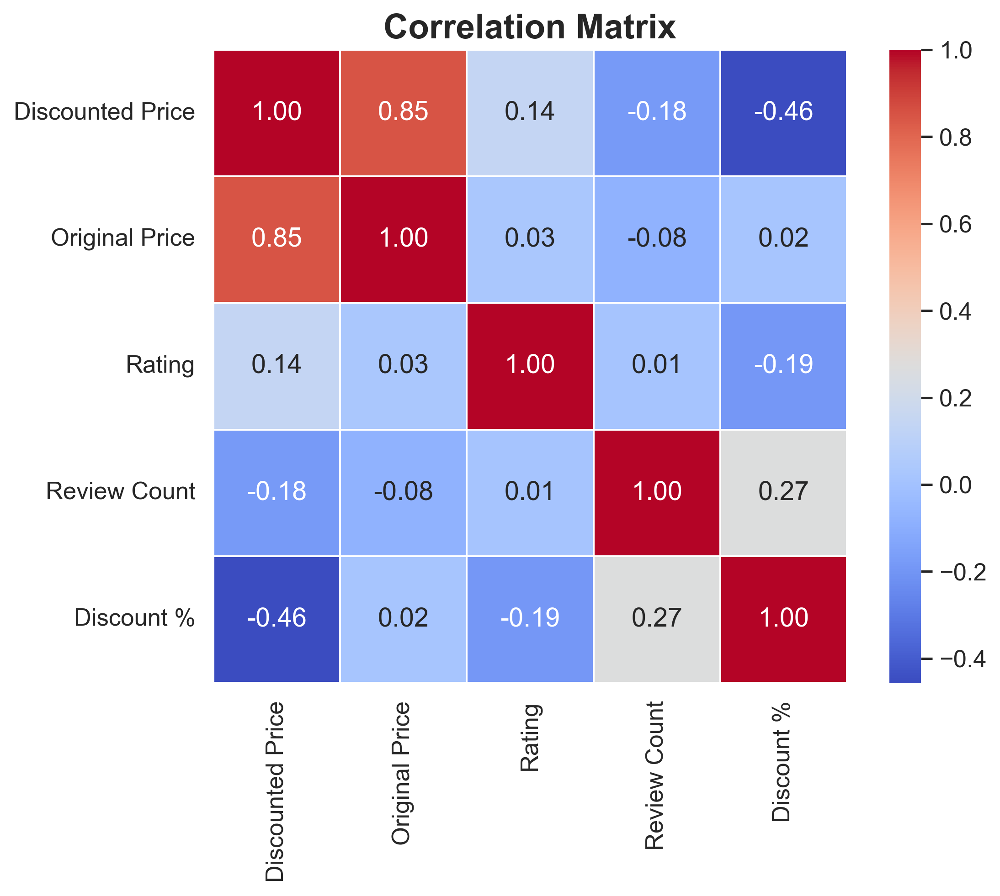

# 🛒 Amazon Sneaker Market Analysis

> **An end-to-end Data Analytics project that uses Web Scraping, Data Cleaning, Exploratory Data Analysis (EDA), and Data Visualization to uncover business insights from Amazon India sneaker listings.**

---

## 📌 Project Overview

With thousands of sneaker products available on Amazon, it is difficult for customers and businesses to understand pricing trends, product quality, customer engagement, and brand performance.

This project demonstrates an end-to-end data analytics workflow by collecting real-world sneaker data from Amazon India, cleaning and preprocessing the dataset, performing exploratory data analysis (EDA), and generating actionable business insights using Python.

---

## 🎯 Problem Statement

Amazon hosts thousands of sneaker listings with varying prices, discounts, ratings, and customer reviews. However, it is challenging to identify:

- How pricing and discounts influence customer engagement.
- Whether premium-priced sneakers receive better customer ratings.
- Which brands dominate the marketplace.
- What factors contribute to product popularity.

This project aims to answer these questions through data-driven analysis.

---

## 🎯 Objectives

- Scrape sneaker product data from Amazon India.
- Clean and preprocess the collected dataset.
- Perform Univariate, Bivariate, and Multivariate Analysis.
- Identify relationships between pricing, ratings, discounts, and reviews.
- Generate business insights to support pricing and marketing decisions.

---

# 🛠 Tech Stack

| Category | Tools |
|----------|-------|
| Programming Language | Python |
| Web Scraping | Requests, BeautifulSoup |
| Data Processing | Pandas, NumPy |
| Data Visualization | Matplotlib, Seaborn |
| Development Environment | Jupyter Notebook |
| Version Control | Git & GitHub |

---

# 📊 Dataset Information

| Attribute | Details |
|-----------|---------|
| Source | Amazon India |
| Total Products | 392 |
| Features | 9 |
| Format | CSV |

### Dataset Features

- ASIN
- Product Title
- Discounted Price
- Original Price
- Rating
- Review Count
- Discount %
- Rating Category
- Popularity

---

# 🔄 Project Workflow

```text
Amazon Website
       │
       ▼
Web Scraping
       │
       ▼
Data Cleaning & Preprocessing
       │
       ▼
Exploratory Data Analysis (EDA)
       │
       ▼
Data Visualization
       │
       ▼
Business Insights
```

---

# 🧹 Data Cleaning

The following preprocessing steps were performed:

- Removed missing values
- Converted prices into numeric format
- Converted ratings into numeric format
- Cleaned review count values
- Removed duplicate records
- Created new features:
  - Discount %
  - Rating Category
  - Popularity Category

---

# 📈 Exploratory Data Analysis

### ✅ Univariate Analysis

- Price Distribution
- Rating Distribution
- Review Count Distribution

### ✅ Bivariate Analysis

- Price vs Rating
- Discount vs Review Count
- Top 10 Sneaker Brands
- Highest Rated Brands
- Top 10 Most Expensive Sneakers
- Top 10 Cheapest Sneakers

### ✅ Multivariate Analysis

- Correlation Heatmap

---

# 💡 Key Business Insights

- Most sneakers belong to the **budget and mid-range price segment**, indicating that affordability drives the market.
- Customer ratings are consistently high across brands, suggesting strong overall product satisfaction.
- Premium-priced sneakers do **not necessarily receive higher ratings**, indicating that customers value quality and comfort more than price.
- A small number of products account for the majority of customer reviews, highlighting the importance of visibility and customer trust.
- Leading brands dominate the marketplace by offering a wider range of sneaker products.
- Original Price and Discounted Price show a strong positive correlation, while customer ratings have only a weak relationship with pricing variables.

---

# 📷 Project Preview


### Price Distribution



---

### Top Sneaker Brands



---

### Correlation Heatmap



---

# 📊 Business Impact

This analysis can help businesses:

- Understand pricing trends within the sneaker market.
- Identify top-performing brands.
- Improve pricing strategies.
- Increase customer engagement through review optimization.
- Support data-driven marketing decisions.
- Understand customer purchasing behavior.

---

# ⚠ Challenges Faced

- Amazon anti-scraping restrictions.
- Dynamic HTML structure.
- Missing and inconsistent values.
- Data cleaning and preprocessing.
- Maintaining accurate product information across multiple pages.

---

# 🔮 Future Improvements

- Automate scraping using Selenium.
- Expand the analysis to multiple product categories.
- Develop an interactive Power BI dashboard.
- Build a Streamlit web application.
- Apply Machine Learning models for price prediction and product recommendation.

---

# 🚀 Installation

Clone the repository

```bash
git clone https://github.com/Tejas2208/amazon-sneaker-market-analysis.git
```

Navigate to the project folder

```bash
cd amazon-sneaker-market-analysis
```

Install dependencies

```bash
pip install -r requirements.txt
```

Launch Jupyter Notebook

```bash
jupyter notebook
```

---

# 👨‍💻 Author

**Tejas Lakhapati Koli**

- 💼 LinkedIn: *([LinkedIn](https://www.linkedin.com/in/tejaskoli22/))*
- 💻 GitHub: *([GitHub](https://github.com/Tejas2208))*

---

## ⭐ If you found this project interesting, consider giving it a Star!

Feedback, suggestions, and contributions are always welcome.
